# 💧 WATEERDROP – Full Development & Debugging Documentation

## 📌 Overview
WATEERDROP is a smart water delivery application with:
- **Frontend:** React (Vite or CRA) → `http://localhost:3000`
- **Backend:** Node.js + Express → `http://localhost:8080`
- **Database:** MongoDB Atlas

### Features
- Browse products (2L, 5L, 10L, 20L, 30L bottles)
- Add to cart & checkout
- View orders
- Admins can manage products, orders, and view dashboard stats

---

## 🗂 Project Structure

```
WATEERDROP/
├── backend/
│   ├── server.js
│   ├── routes/
│   ├── models/
│   └── controllers/
├── frontend/
│   ├── src/
│   │   ├── pages/
│   │   ├── components/
│   │   └── App.js
│   └── package.json
└── README.md
```

---

## 🛠 Development Flow

### **Phase 1 – Initial Setup**
- Created React frontend and Express backend.
- Connected backend to MongoDB Atlas.
- Set up routes for products, orders, and users.

---

### **Phase 2 – Routing & Missing Component Fix**
**Issue:**  
```

Module not found: Error: Can't resolve './pages/AdminDashboard'

```
**Fix:**  
Created `src/pages/AdminDashboard.jsx` with quick links to admin sections.

---

### **Phase 3 – Admin Dashboard Enhancement**
- Added `/admin/stats` backend route returning:
  - Total orders
  - Pending orders
  - Delivered orders
  - Total products
  - Low stock count
  - Total users
- Updated `AdminDashboard.jsx` to fetch and display stats.

---

### **Phase 4 – ESLint Warnings**
**Warning:**  
```

React Hook useEffect has a missing dependency: 'fetchOrders'

````
**Fix:**  
Wrapped `fetchOrders` in `useCallback` and added it to dependency array.

---

### **Phase 5 – Products Page Data Mismatch**
**API Response:**
```json
{
  "total": 5,
  "page": 1,
  "totalPages": 1,
  "products": [
    { "name": "Water Bottle", "sizeLiters": 2, "price": 20, "stock": 100 }
  ]
}
````

**Fix:**
Updated frontend to use `p.sizeLiters` instead of missing fields.

---

### **Phase 6 – CORS Issue**

**Error:**

```
Access to XMLHttpRequest at 'http://localhost:8080/products' from origin 'http://localhost:3000' has been blocked by CORS policy
```

**Cause:**
Backend not sending `Access-Control-Allow-Origin` header.

**Fix:**

```js
import cors from 'cors';
app.use(cors({
  origin: 'http://localhost:3000',
  credentials: true
}));
```

---

### **Phase 7 – Running Both Frontend & Backend Together**

Options:

1. **Development:** Use `"proxy": "http://localhost:8080"` in frontend `package.json`.
2. **Production:** Serve React build from Express backend.

---

### **Phase 8 – Parallax Landing Page**

* Created `ParallaxSection` component.
* Built `Home.jsx` with parallax sections, feature bands, and CTAs.

---

## 🔄 Flowchart – Request Lifecycle


---

## 🐞 Troubleshooting Guide

| Symptom                         | Likely Cause                             | Fix                             |
| ------------------------------- | ---------------------------------------- | ------------------------------- |
| `Module not found`              | Missing file/component                   | Create file or fix import path  |
| `React Hook missing dependency` | Function used in `useEffect` not in deps | Wrap in `useCallback` or inline |
| `Failed to load products`       | Field mismatch or undefined array        | Match API keys, add safe checks |
| CORS error                      | Backend not allowing frontend origin     | Enable CORS in backend          |
| All pages failing               | API calls blocked by browser             | Fix CORS or use proxy           |

---

## 📊 System Architecture

```mermaid
graph LR
    subgraph Frontend [React App – Port 3000]
        UI[UI Components]
        State[State Management]
    end

    subgraph Backend [Express API – Port 8080]
        Routes[API Routes]
        Controllers[Controllers]
        Models[MongoDB Models]
    end

    subgraph Database [MongoDB Atlas]
        Collections[Products, Orders, Users]
    end

    UI --> State
    State --> Routes
    Routes --> Controllers
    Controllers --> Models
    Models --> Collections
```



---

## ✅ Current Status

* Backend: Running on `8080`, CORS fixed, API functional.
* Frontend: Running on `3000`, pages render correctly.
* Admin Dashboard: Stats working.
* Products Page: Displays items from backend.
* Parallax Home Page: Built and styled.

---

## 🚀 Next Steps

1. Deploy backend & frontend together.
2. Secure admin routes with authentication.
3. Add error boundaries for better UX.
4. Apply consistent UI styling.

---

## 📌 Notes

* Start **backend before frontend** in dev.
* Use `.env` for sensitive configs.
* Update CORS config for deployed domain.

---

```
```
